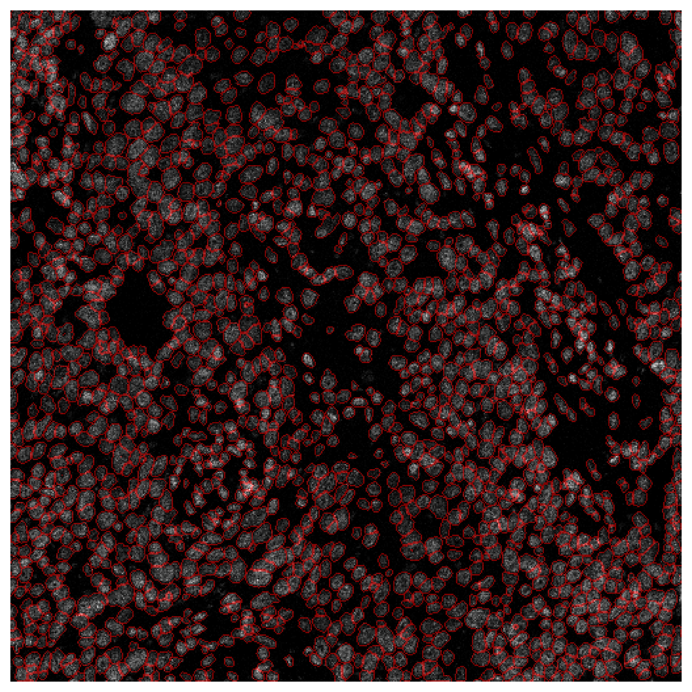

# py-imcyto
IMC segmentation in python.

pyimcyto is a python library for nuclear and cellular segmentation in imaging mass cytometry images.

The segmentation model uses a U-net++ archiecture with autoencoder-based anomaly detection to refine predictions, and is the same as the **deep-imcyto** segmentation model which is distributed as part of [TRACERx-PHLEX](https://github.com/FrancisCrickInstitute/TRACERx-PHLEX) -- a Nextflow-based multiplexed image analysis pipeline, however the implementation is designed for those who wish to use the model itself directly in their own python code.

# Getting started

1. Download the trained deep-imcyto model weights from our [Zenodo repository](https://doi.org/10.5281/zenodo.7573269)

2. Clone the pyimcyto repository


3. Create a new environment and install the necessary dependencies:

<!-- conda install -c conda-forge cudatoolkit=11.8.0 scikit-learn -->

```console
conda create -n deepimcyto python=3.8 numpy pandas scipy matplotlib scikit-image cudatoolkit=11.8.0 scikit-learn -c conda-forge -c anaconda
```
Install Tensorflow and other dependencies from pip:
```
pip install nvidia-cudnn-cu11==8.6.0.163 tensorflow==2.12.* jupyter opencv-python cupy-cuda11x tqdm
```


<!-- ```console
pip install jupyter tensorflow==2.12 opencv-python cupy-cuda11x tqdm
``` -->

# Usage

```python
from pyimcyto.seg import deepimcyto
import skimage.io as io

# define the path to the deep-imcyto model weights directory:
weights = './weights'

# create the deep-imcyto model with the trained weights:
dicy = deepimcyto(weights)

# read in an IMC image:
img_path = './data/P1_TMA006_L_20190619-roi_6.ome-roi_p1_tma006_l_20190619-roi_6.png'
img = io.imread(img_path)

# predict nuclei:
result = dicy.predict(img)

# visualize results:
dicy.get_boundaries() # get boundaries of instance mask
dicy.make_overlays() # overlay on test image

# Plot result:
fig, ax = plt.subplots(1, 1, figsize=(10, 10))
ax.imshow(overlay[overlay.shape[0]//2 - 256:overlay.shape[0]//2 + 256, overlay.shape[1]//2 - 256:overlay.shape[1]//2 + 256]) # plot 512x512 tile in centre of test image
ax.set_axis_off()
plt.tight_layout()
```


See the example jupyter notebook for more examples of usage.

# Citation


# Credits

deep-imcyto/py-imyto is primarily developed by [Alastair Magness](mailto:alastair.magness@crick.ac.uk) at [The Francis Crick Institute](https://www.crick.ac.uk).